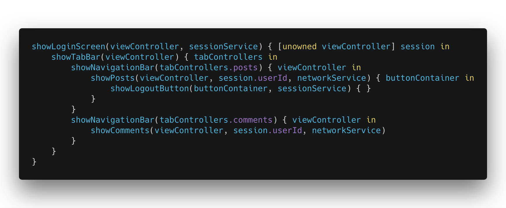

#🏛 Feature Driven Architecture
An iOS example project for a use case-driven architecture.

## ☝️ What is inside?

The simple Blog application is featuring:

- Feature-driven architecture
- Modularization example

## ✌️ Who is it for?

The project helps to understand:

- How to stop building UI driven-apps
- How to create an app from the composition of small independent blocks
- How to describe an app flow in a natural, readable manner
- How to split an app into modules/frameworks

## ⚙️ Modules

## 🌟 Features
Features describe single use-case or presentation requirement

Features:

- Have one job
- Independent of other features
- Make decisions (if, switch, etc.)
- Might have no UI or add UI later
- Decide own lifetime

Features describing *use cases*:

- Login screen (Persistent session)
- Logout button
- Posts screen
- Comments screen
- Push notifications handling

Features describing *presentation*:

- Window
- Tab Bar
- Navigation Bar

## 🔱 Flows

Flows describe the composition of features.

Flows are:

- Readable
- Makes no decisions (if, switch, etc.)
- Doesn’t make assumptions about Feature lifetimes

